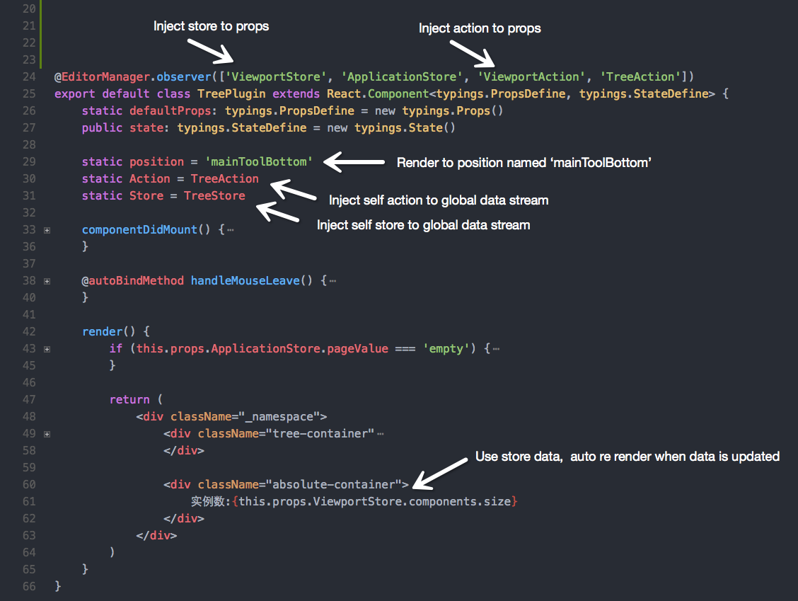

# 1 GaeaEditor

A cross three end online application editor.

# 2 Usage

# 3 Developer - Create your own plugin

Import `EditorManager` first.

```typescript
import {EditorManager} from 'gaea-editor'
```

The following is a complete screenshot, so you understand the principles of plugin work:

`tree.component.tsx`:



`tree.action.ts`:


`tree.store.ts`:


## 3.1 Render to editor

Then create `my-first-plugin.tsx`, and render it in the navigation bar:

```typescript
class MyFirstPlugin extends React.Component <any, any> {
    // Render to the left navbar
    static position = 'navbarLeft'
    
    render () {
        return (
            <div>Hello world</div>
        )
    }
}
```

```typescript
<GaeaEditor plugins={[MyFirstPlugin]}/>
```

## 3.2 Inject data stream

```typescript
@EditorManager.observer(['ApplicationStore'])
class MyFirstPlugin extends React.Component <any, any> {
    // Render to the left navbar
    static position = 'navbarLeft'
    
    render () {
        return (
            <div>viewport backgroundColor : {this.props.ApplicationStore.viewportStyle.backgroundColor}</div>
        )
    }
}
```

Now change the background color:

```typescript
@EditorManager.observer(['ApplicationStore', 'ApplicationAction'])
class MyFirstPlugin extends React.Component <any, any> {
    // Render to the left navbar
    static position = 'navbarLeft'
    
    handleClick () {
        this.props.ApplicationAction.viewportStyleSet({
            backgroundColor: '#f5f5f5'
        })
    }
    
    render () {
        return (
            <div onClick={this.handleClick.bind(this)}>viewport backgroundColor : {this.props.ApplicationStore.viewportStyle.backgroundColor}</div>
        )
    }
}
```

## 3.3 With type helper

```typescript
interface Props {
    ApplicationStore: EditorManager.ApplicationStore
    ApplicationAction: EditorManager.ApplicationAction
}

@EditorManager.observer(['ApplicationStore', 'ApplicationAction'])
class MyFirstPlugin extends React.Component <Props, {}}> {
    // ...
}
```

## 3.4 Create plugin store

Create `store.ts`:

```typescript
export default class MyFirstPluginStore {
    // will auto render component when updated
    @EditorManager.observable variable = 'apple'
}
```

Define attribute `Store` in class, and inject it:

```typescript
// inject MyFirstPluginStore
@EditorManager.observer(['MyFirstPluginStore'])
class MyFirstPlugin extends React.Component <any, any> {
    static position = 'navbarLeft'
    // Can automatically injected into the editor and referenced by lower case first letter.
    static Store = MyFirstPluginStore
    
    render () {
        return (
            <div>{this.props.MyFirstPluginStore.variable}</div>
        )
    }
}
```

Or inject core store to your store:

```typescript
export default class MyFirstPluginStore {
    @EditorManager.inject('ViewportStore') private viewport: ViewportStore

    // log current hover mapUniquekey
    @EditorManager.computed get currentHoverTreeDom() {
        return 'current hover mapUniqueKey: ' + this.viewport.currentHoverComponentMapUniqueKey
    }
}
```

## 3.5 Create plugin action

Similar to create store, can inject any store:

```typescript
export default class MyFirstPluginAction {
    @EditorManager.inject('MyFirstPluginStore') private myFirstPluginStore: myFirstPluginStore

    @EditorManager.action('set variable') setVariable(variable: string) {
        this.myFirstPluginStore.variable = variable
    }
}
```

Inject and use it:

```typescript
@EditorManager.observer(['MyFirstPluginStore', 'MyFirstPluginAction'])
class MyFirstPlugin extends React.Component <any, any> {
    static position = 'navbarLeft'
    static Store = MyFirstPluginStore
    static Action = MyFirstPluginAction
    
    componentWillMount () {
         this.props.MyFirstPluginAction.setVariable('two')
    }
    
    render () {
        return (
            <div>{this.props.MyFirstPluginStore.variable}</div>
        )
    }
}
```

## 3.6 Create Plugin render position

In addition to rendering in the editor to provide location such as the navigation bar, the plug-in can also set aside their own location for other plug-ins to expand.

```typescript
@EditorManager.observer(['ApplicationAction'])
class MyFirstPlugin extends React.Component <any, any> {
    // Render to the left navbar
    static position = 'navbarLeft'
    
    render () {
        return (
            <div>
                <div className="left-hook">
                    // other plugin can set to this position:
                    // static position = 'myPluginLeftHook'
                    this.props.ApplicationAction.loadingPluginByPosition('myPluginLeftHook')
                </div>
                <div className="right-hook">
                    this.props.ApplicationAction.loadingPluginByPosition('myPluginRightHook')
                </div>
            </div>
        )
    }
}
```

## 3.7 Extend Edit Type

You can named `static position='editorAttributeCustomName'` to handle `editor='customName'`.

## 3.8 Deploy plugin

Gaia editor included the following plug-ins to ensure that the core function of stability: 

- tab-tools
- tab-tools-components
- tab-tools-components-common
- tab-tools-components-custom
- tab-tools-components-combo
- tab-tools-version
- editor-tabs
- editor-tabs-attribute
- editor-tabs-attribute-text
- editor-tabs-attribute-number
- editor-tabs-attribute-background
- editor-tabs-attribute-border
- editor-tabs-attribute-font
- editor-tabs-attribute-instance
- editor-tabs-attribute-layout
- editor-tabs-attribute-margin-padding
- editor-tabs-attribute-overflow
- editor-tabs-attribute-position
- editor-tabs-attribute-select
- editor-tabs-attribute-switch
- editor-tabs-attribute-width-height
- editor-tabs-event
- preview
- publish
- save
- copy-paste
- crumbs
- delete
- viewport-size
- viewport-guideline
- show-layout-button
- tree
- global-setting

You can also manually add your own plug-ins by the following way, if you want to be built in the project, you can send me an e-mail.

```typescript
<GaeaEditor plugins={[MyFirstPlugin]}/>
```

## 3.9 core data stream

### 3.9.1 Actions

**`ApplicationAction`** **`ViewportAction`** **`EventAction`**

#### 3.9.1.1 ApplicationAction

| Method        | Params           | Description  |
| :------------- |:-------------| :-----|
| loadingPluginByPosition      | position: string, props: any = {} | load plugins UI who's `static position` equal `position` |
| setViewportStyle | style: React.CSSProperties | |
| setViewportContainerStyle | style: React.CSSProperties | |
| resetViewportStyle | | |
| getComponentClassByGaeaUniqueKey | gaeaUniqueKey: string | get Class by uniqueKey |
| setPreview | inPreview: boolean | set preview statu |
| updatePage | pageValue: string | re render full editor viewport |


#### 3.9.1.2 ViewportAction

#### 3.9.1.3 EventAction

### 3.9.2 Stores

**`ApplicationStore`** **`ViewportStore`** **`EventStore`**

#### 3.9.2.1 ApplicationStore

#### 3.9.2.2 ViewportStore

#### 3.9.2.3 EventStore